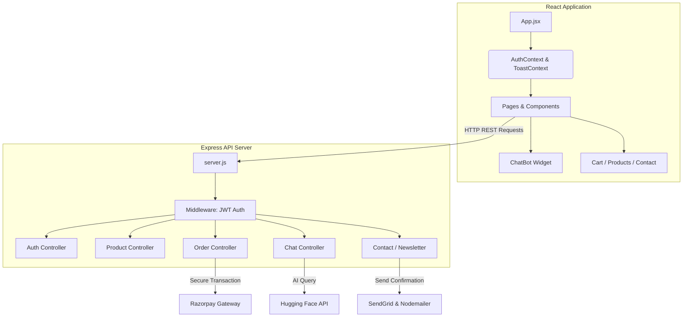

# RajStore — Architectural Walkthrough & System Design

RajStore is a modern full-stack E-Commerce ecosystem built with a modular React architecture and an Express/MongoDB backend service layer. This document walks through the structural layout, core features, component interactions, and key integrations implemented in the system.

---

## 🏗️ System Architecture & Data Flow

The application is structured into two decoupled layers communicating over a JSON REST API:

---

## 🌟 Implemented Features & Workflows

### 1. User Authentication Flow
- **Registration**: Captures user info, hashes passwords using `bcrypt` (10 salt rounds), and persists them in MongoDB.
- **Login & Sessions**: Validates credentials and generates a signed JWT. On the client side, this token is stored in the browser's local storage and managed via `AuthContext`.
- **Protected Actions**: Operations such as checkout and checking cart state require a valid JWT passed in the HTTP `Authorization: Bearer <token>` header, verified by backend `authMiddleware.js`.

### 2. E-Commerce Core & Checkout
- **Catalog Management**: Dynamic product loading from MongoDB. Seeded database contains pre-configured items.
- **Stateful Shopping Cart**: Tracks quantities, adds/removes items, and computes subtotals on the fly.
- **Payment Processing (Razorpay)**: 
  - Cart checkout contacts `/api/orders/checkout` to create a secure order.
  - Razorpay SDK initializes a checkout modal on the frontend.
  - Upon successful payment verification, the order is registered under the user's profile.

### 3. AI Support Chatbot Widget
- A persistent chatbot widget residing in the lower-right corner of the application allows real-time user engagement.
- **Smart Product Recommendations**: Users can query products; the backend parses intent and attaches matching product cards (price, stock, image) to the chat bubble.
- **Natural Language Fallback**:
  - Leverages Hugging Face's `facebook/blenderbot-400M-distill` model via API for fluid conversation.
  - Gracefully falls back to concise programmatic replies if no API token is configured.

### 4. Notification & Marketing Engines
- **Double-Layer Email Delivery**: Handles contact submissions and subscription registrations using both **Nodemailer (SMTP)** and the **SendGrid API**.
- **Contact Forms**: Sends user queries directly to administrative mailboxes.
- **Newsletter Subscription**: Seamlessly tracks subscribers for promotional outreach.

---

## 📂 Codebase Breakdown

### Backend Structure (`/backend`)
- **`models/`**: Defines the data schema rules:
  - `User`: Handles accounts, permissions, and credentials.
  - `Product`: Stores description, inventory, images, and prices.
  - `Order`: Maps purchases to users, status, payment details, and total amount.
- **`controllers/` & `routes/`**: Handles application logic for individual REST domains:
  - `authRoutes`: Login, registration.
  - `productRoutes`: Catalog endpoints.
  - `orderRoutes`: Protected checkouts.
  - `chatRoutes`: Product-aware AI assistance.
  - `contactRoutes` & `newsletterRoutes`: Lead capture and alerts.

### Frontend Structure (`/frontend/ecommerce_frontend`)
- **`context/`**: Contains React Context providers (`AuthContext.jsx` for user session management; `ToastContext.jsx` for pop-up notification toasts).
- **`pages/`**: Single Page App routes including `Home`, `Products`, `cart` (with route protection), `Login`, `Register`, and `AdminDashboard`.
- **`components/ChatBot/`**: A self-contained directory containing components for the floating chat button, window, input, bubble rendering, and product recommendations.
- **`services/`**: Abstracts HTTP requests using customized Axios instances pointing to `/api` routes.

---

## 🎨 Styling & Design Aesthetics

- **TailwindCSS (v4)**: Used for rapid layout building, flex grids, spacing, responsive viewports, and clean modern interfaces.
- **React-Bootstrap**: Combined to provide accessible, structured UI components (modals, forms, navigation structures).
- **Aesthetic Additions**: Inter font styling, subtle micro-animations for interactive cards, smooth floating transition states, and glassmorphic elements in the AI Chatbot widget.
